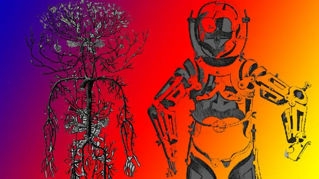
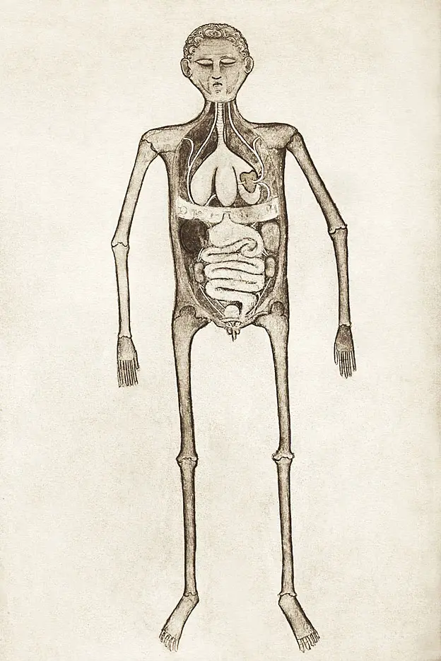
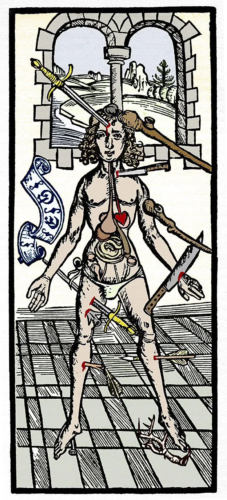
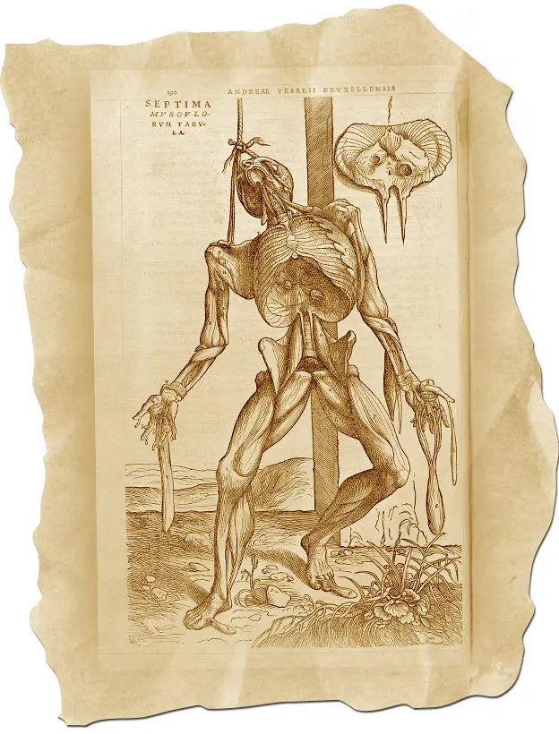
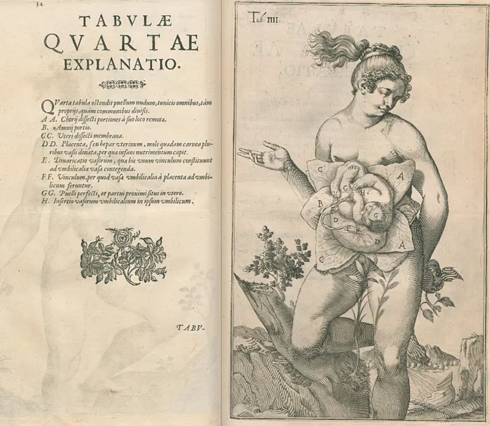
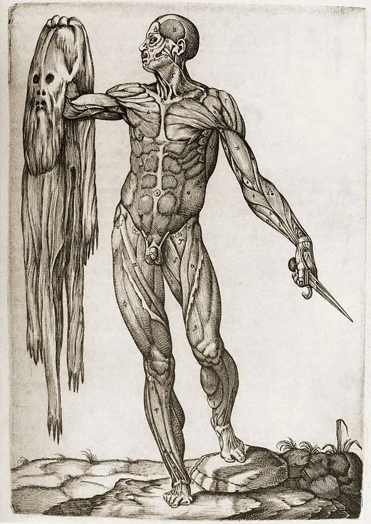
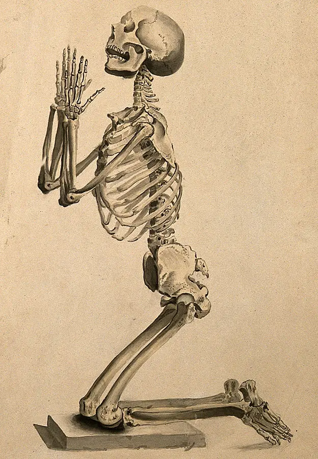
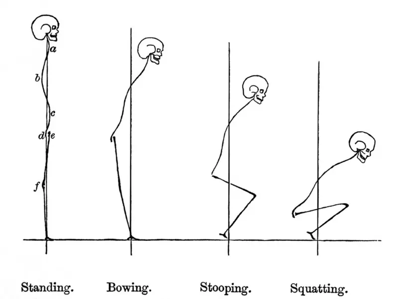
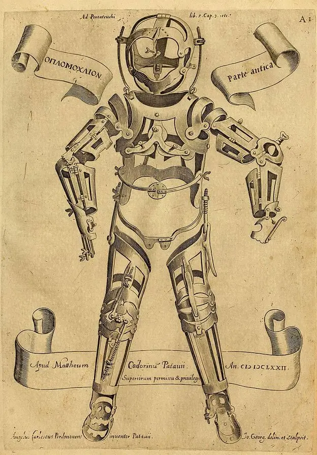

# Anatomical illustration - seven historical body images

## Source

Article: *7 excepcionales ilustraciones de la anatomía humana de intrépidos científicos de siglos pasados*  
Publisher: BBC News Mundo  
Author: Redacción, BBC News Mundo  
Date: 3 November 2018  
URL: https://www.bbc.com/mundo/noticias-45880391

## Before the scanned body

Before the body could be recorded through radiography, tomography, magnetic resonance, PET, infrared imaging, or digital reconstruction, anatomical knowledge depended on manual and graphic operations. The body had to be opened, observed, selected, copied, engraved, printed, staged, simplified, or dramatized.

The examples gathered by BBC Mundo are useful not as historical curiosities, but as a small genealogy of anatomical visibility. They show that the body has never appeared as a neutral object. It becomes visible through specific image systems: the manuscript diagram, the wound chart, the theatrical cadaver, the fetal plate, the flayed figure, the expressive skeleton, the posture diagram, and the orthopedic device.

These images belong to a longer history of bodily visualization in which the body is not simply represented, but transformed into a readable surface.
<dialog id="bbcAnatomyModal00" class="image-modal" onclick="this.close()">
  
</dialog>

## Image, body, operation

The article can be read as a sequence of visual operations. Each image produces a different anatomical body.

One image reduces the body to a schematic relation between skeleton and organs. Another turns the body into a map of wounds. Another stages the dissected body as a dramatic figure. Another organizes fetal anatomy through a composed female image. Another makes the flayed body carry its own skin. Another gives gesture and affect to the skeleton. Another reduces the body to posture and gravity. The final image shifts from representation to correction, presenting an apparatus designed to act on the body.

Together, they form a compact history of how anatomical images organize violence, knowledge, visibility, and control.

### Guido da Vigevano, *Anathomia* (1345)

<figure>
  

  <figcaption>
    Illustration from Guido da Vigevano’s <em>Anathomia</em> (1345), showing the skeleton and internal organs of the torso.
  </figcaption>
</figure>

<dialog id="bbcAnatomyModal01" class="image-modal" onclick="this.close()">
  
</dialog>

The illustration from Guido da Vigevano’s *Anathomia* shows the body in a simple, frontal arrangement. The skeleton and organs appear as a basic anatomical schema. The image does not yet create the complex spatial illusion of later Renaissance anatomy, but it establishes an important operation: the inside of the body is translated into a diagram that can circulate with a manuscript.

Here, anatomical knowledge depends on simplification. The body is not shown as an individual, nor as a dramatic cadaver. It is organized as a readable configuration of parts. This early schematic body marks a transition from the body as described textually to the body as visual structure.

### The Wound Man

<figure>
  

  <figcaption>
    <em>Wound Man</em> / <em>Hombre Herido</em>, a surgical image that maps possible wounds and injuries across the body.
  </figcaption>
</figure>

<dialog id="bbcAnatomyModal02" class="image-modal" onclick="this.close()">
  
</dialog>

The *Wound Man* does not open the body to reveal organs. It turns the body surface into a catalogue of possible injury. Weapons, cuts, punctures, and wounds are distributed across the figure as if the body were a battlefield or a surgical map.

Its visual logic is topographical. The body becomes a place where violence can be located, named, and treated. It is not an anatomical interior but a surface of trauma.

This image is important for a genealogy of the body because it organizes injury as knowledge. The body appears through damage. The figure is not only wounded; it is made legible through the distribution of wounds.

### Andreas Vesalius, *De humani corporis fabrica* (1543)

<figure>
  

  <figcaption>
    Illustration from Andreas Vesalius’s <em>De humani corporis fabrica</em>, where the dissected body is staged as an animated figure.
  </figcaption>
</figure>

<dialog id="bbcAnatomyModal03" class="image-modal" onclick="this.close()">
  
</dialog>

With Vesalius, the opened body becomes theatrical. The dissected figure is not presented as passive material. It stands, gestures, and appears almost alive, even as its muscles and interior structures are exposed.

This tension is central. Anatomical knowledge requires the dead body, but the image gives that body animation, posture, and dramatic presence. The cadaver becomes a performer of its own exposure.

The image does not simply reveal anatomy. It stages revelation. It makes dissection visible through the conventions of art, landscape, gesture, and humanist composition.

### Casseri and Adriaan van de Spiegel, fetal anatomy

<figure>
  

  <figcaption>
    Fetal anatomy image associated with Giulio Cesare Casseri and Adriaan van de Spiegel’s <em>De formato foetu liber singularis</em>.
  </figcaption>
</figure>

<dialog id="bbcAnatomyModal04" class="image-modal" onclick="this.close()">
  
</dialog>

This image combines anatomical explanation with pictorial convention. The female body appears carefully composed, partly veiled by ornament, while the image also refers to fetal development.

The anatomical content is not presented through direct exposure alone. It is mediated through decorum, beauty, and staging. The flower that covers the genitals is not incidental: it marks the negotiation between visibility and concealment, between anatomical instruction and the cultural limits of what can be shown.

The body here is not only opened to knowledge. It is arranged so that knowledge can appear within an acceptable visual form.

### Juan Valverde de Amusco, *Anatomía del cuerpo humano* (1560)

<figure>
  

  <figcaption>
    Flayed figure from Juan Valverde de Amusco’s <em>Anatomía del cuerpo humano</em> (1560), holding its own removed skin.
  </figcaption>
</figure>

<dialog id="bbcAnatomyModal05" class="image-modal" onclick="this.close()">
  
</dialog>

The flayed figure from Juan Valverde de Amusco is one of the clearest examples of the anatomical body as staged body. The figure stands upright and holds its own removed skin, as if presenting the condition of its own exposure.

The image creates a paradox. The skin is both part of the body and an object separated from it. The body appears as subject, specimen, surface, and evidence at the same time.

This is not simply a representation of muscles. It is a scene of anatomical self-display. The body performs the violence that makes it visible.

### William Cheselden, *Osteographia* (1732)

<figure>
  

  <figcaption>
    Kneeling skeleton from William Cheselden’s <em>Osteographia</em> (1732).
  </figcaption>
</figure>

<dialog id="bbcAnatomyModal06" class="image-modal" onclick="this.close()">
  
</dialog>

In Cheselden’s *Osteographia*, the skeleton is not only a structural framework. It is posed. The kneeling figure gives bone an expressive and almost devotional presence.

This image shows how anatomical accuracy and theatricality can coexist. The skeleton, often imagined as the most neutral or structural part of the body, is given gesture, orientation, and affect.

The body is reduced to bone, but not to neutrality. Even the skeleton becomes an image of posture, emotion, and human drama.

### George Murray Humphry, *The Human Foot and the Human Hand* (1861)

<figure>
  

  <figcaption>
    Posture diagrams from George Murray Humphry’s <em>The Human Foot and the Human Hand</em> (1861), showing body outlines in relation to gravity.
  </figcaption>
</figure>

<dialog id="bbcAnatomyModal07" class="image-modal" onclick="this.close()">
  
</dialog>

The posture diagram shifts the anatomical image away from dissection. The body is not opened, wounded, or flayed. It is reduced to outline, curvature, balance, and relation to gravity.

This image belongs to a different visual logic: the body as mechanical alignment. The anatomical problem is no longer what is inside the body, but how the body stands, bends, distributes weight, and maintains equilibrium.

The diagram anticipates a way of seeing the body as posture, force, and axis. Anatomy becomes biomechanics.

### Girolamo Fabrizi d’Acquapendente, Oplomoclion

<figure>
  

  <figcaption>
    Oplomoclion designed by Girolamo Fabrizi d’Acquapendente, an orthopedic apparatus for correcting deformities of the spine and limbs.
  </figcaption>
</figure>

<dialog id="bbcAnatomyModal08" class="image-modal" onclick="this.close()">
  
</dialog>

The Oplomoclion is not an anatomical body image in the same sense as the others. It is an apparatus. Its inclusion is important because it shifts the sequence from representation to intervention.

The device translates anatomical knowledge into mechanical correction. The body is no longer only drawn, opened, mapped, or staged. It becomes something that can be supported, disciplined, aligned, and modified by a technical object.

This image opens a passage from anatomical illustration to prosthetic, orthopedic, and corrective technologies. The visual history of the body is also a history of devices built around the body.

## A genealogy of anatomical visibility

These examples show that anatomical illustration is not simply a predecessor to medical imaging. It is part of the same longer problem: how to make the body visible, legible, transmissible, and actionable.

The historical images collected in the article operate through different forms of transformation:

the body as schema  
the body as wound map  
the body as staged cadaver  
the body as fetal image  
the body as flayed surface  
the body as expressive skeleton  
the body as posture and gravity  
the body as corrected structure

This sequence matters because contemporary medical images also depend on operations that select, translate, and organize the body. CT, MRI, PET, infrared imaging, segmentation, and 3D reconstruction do not simply show the body “as it is.” They produce body-images through technical systems.

The anatomical illustrations in this article make that older visual history visible. Long before the scanned body, the body was already being processed into images.

## Key terms

anatomical illustration  
medical illustration  
Guido da Vigevano  
*Anathomia*  
Wound Man  
Johannes de Ketham  
*Fasciculus Medicinae*  
Hieronymus Brunschwig  
Andreas Vesalius  
*De humani corporis fabrica*  
Jan Stephen van Calcar  
Giulio Cesare Casseri  
Adriaan van de Spiegel  
Juan Valverde de Amusco  
flayed figure  
William Cheselden  
*Osteographia*  
George Murray Humphry  
posture diagram  
Girolamo Fabrizi d’Acquapendente  
Oplomoclion  
Wellcome Collection  
Science Photo Library

## Connected notes

- [[The body as anatomical territory]]
- [[Visible Human Project - informatic body and digital anatomy]]
- [[Blender - Visible Human slices to volume cube]]
