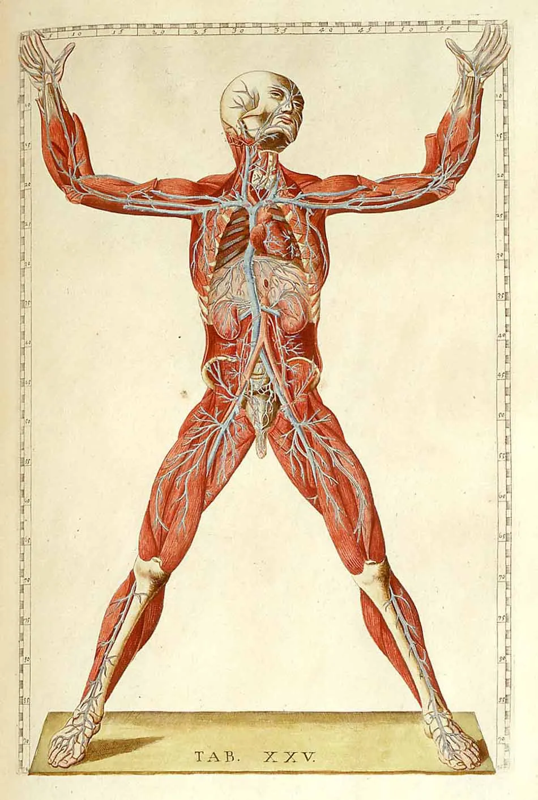
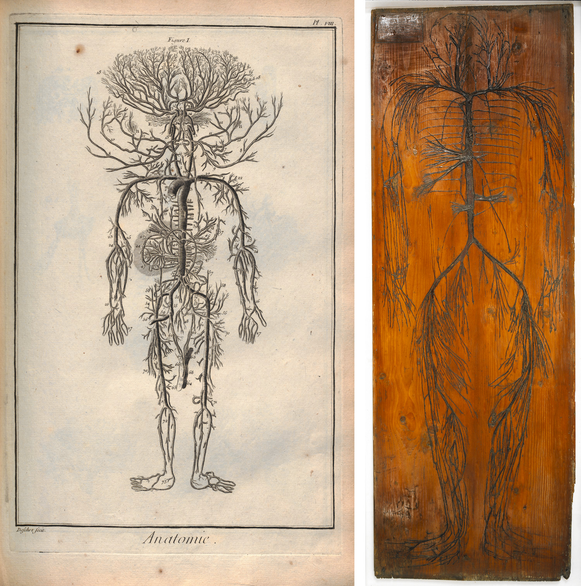
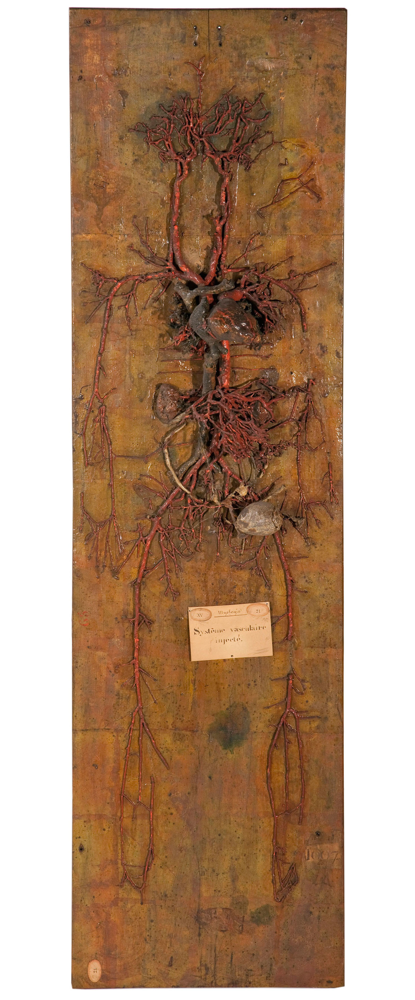

# The body as anatomical territory

Medical imaging belongs to a longer history of making the body visible, legible, and available to knowledge. Before scans, datasets, and AI infrastructures, the body was already being transformed into a visual field through dissection, anatomical tables, wax models, injected vessels, diagrams, and pedagogical displays.

This genealogy matters for *Conjuring the Body* because contemporary medical data does not appear from nowhere. It continues older visual regimes in which the body is opened, separated into systems, fixed onto surfaces, translated into images, and reorganized as something that can be studied from a distance.

The body becomes a territory when it is treated as something that can be mapped. Its interior is divided into routes, regions, systems, layers, and flows. Veins become rivers. Organs become provinces. Anatomical structures become coordinates. The body is no longer only lived from within; it becomes a surface to be read.

In this sense, anatomical representation is not simply a way of revealing the body. It is a way of producing a body that can be ordered, preserved, taught, circulated, and compared.

> The anatomical image does not simply reveal the body; it produces a body that can be read, mapped, preserved, displaced, and circulated.

## Anatomical tables and the mapped body

<figure>
  

  <figcaption>
    Anatomical figure used as a visual reference for the relation between anatomy, measurement, and the mapped body. Source: Daniel Brownstein, “Mapping the Materials of the Human Body.”
  </figcaption>
</figure>

<dialog id="anatomyModal01" class="image-modal" onclick="this.close()">
  
</dialog>

Aglaia Berlutti’s text on the body as territory is useful because it places the Evelyn Tables within a wider relation between anatomy and cartography. The body appears as an interior geography: something that can be opened, traced, delimited, and organized through visual knowledge.

The Evelyn Tables are especially important because they transform bodily material into a pedagogical surface. Veins extracted from a corpse were extended onto wooden boards and preserved, turning the interior of the body into something that could be studied visually. In this gesture, the body becomes both specimen and map.

Reference: [Aglaia Berlutti, “El cuerpo como territorio: anatomía, cartografía y conocimiento en el siglo XVII.”](https://aglaia-berlutti.medium.com/el-cuerpo-como-territorio-anatom%C3%ADa-cartograf%C3%ADa-y-conocimiento-en-el-siglo-xvii-8248532fa85c)

## Mapping as distance

<figure>
  

  <figcaption>
    Comparison between an anatomical plate from Diderot and d’Alembert’s <em>Encyclopédie</em> and an Evelyn Table. The image shows how vessels could be arranged to suggest the human form while also unfolding as a map-like structure.
  </figcaption>
</figure>

<dialog id="anatomyModal02" class="image-modal" onclick="this.close()">
  
</dialog>

Daniel Brownstein’s text on human dissection and the Evelyn Tables helps deepen this relation between anatomy and mapping. The anatomical table is not only a scientific object; it is also a device of distance. It allows the body to be seen, studied, and taught after being separated from the living subject.

Mapping produces knowledge by creating distance. It makes something readable by extracting it from its original context and placing it onto another surface. In the case of the Evelyn Tables, the body is no longer encountered as a whole, but as a disembodied network of veins fixed to wood.

This is important for thinking about medical imaging today. A scan also creates distance. It separates the body into slices, files, metadata, and datasets. What was once part of a clinical encounter can become an object of study, circulation, or computation.

Reference: [Daniel Brownstein, “Mapping the Materials of the Human Body.”](https://dabrownstein.com/category/human-dissection/)

## Wax, corrosion, and the disappearance of the body

<figure>
  

  <figcaption>
    Anonymous, <em>Injected Vascular System (Système vasculaire injecté)</em>, c. 1766–1787. Musée Fragonard de l’École nationale vétérinaire d’Alfort, Maisons-Alfort. © FORGET Patrick/SAGAPHOTO.COM / Alamy Stock Photo. Source: Charles Kang, “Anatomy of the Bel Effet.”
  </figcaption>
</figure>

<dialog id="anatomyModal03" class="image-modal" onclick="this.close()">
  
</dialog>

Charles Kang’s article on the *Injected Vascular System* at the Musée Fragonard is especially relevant because it shows how anatomical visibility can depend on disappearance. The object was produced through injection-corrosion: vessels were injected with a wax compound, while surrounding organic tissues were later dissolved or removed. What remains is a vascular form, suspended between specimen, image, and sculpture.

The result is not simply a preserved body part. It is a technical apparition of the body. The vascular system appears because other parts of the body have disappeared. This produces an object that is both scientific and aesthetic, anatomical and uncanny, evidence and representation.

Reference: [Charles Kang, “Anatomy of the Bel Effet: Wax between Science and Art.” *Journal18*.](https://www.journal18.org/issue3/anatomy-of-the-bel-effet-wax-between-science-and-art/)

Figure reference: [Anonymous, *Injected Vascular System (Système vasculaire injecté)*, c. 1766–1787, Musée Fragonard de l’École nationale vétérinaire d’Alfort.](https://www.journal18.org/issue3/anatomy-of-the-bel-effet-wax-between-science-and-art/#_edn)

> To make one layer of the body visible, another layer must disappear.

## From anatomical territory to bodily data

These historical examples help frame contemporary medical imaging as part of a longer visual genealogy. The CT scan, MRI, or anatomical dataset does not simply replace older anatomical objects. It continues their logic through different technical means.

The chain might be understood like this:

dissection → anatomical table → wax model → medical scan → dataset → AI infrastructure

Across these forms, the body becomes legible through processes of selection, extraction, preservation, abstraction, and display. Each technique produces a different kind of body: vascular, skeletal, pathological, segmented, anonymized, computational, or machine-readable.

In contemporary medical imaging, the disappearance is no longer only material. It can happen through anonymization, compression, metadata extraction, segmentation, cloud storage, or machine learning. The body does not need to be physically dissolved in order to become abstracted. It can be transformed into data.

This does not mean that the body disappears completely. Something remains: a trace, a fragment, a pattern, a measurable intensity, a residual presence. The question is how to approach that remainder without treating it as neutral information.

For *Conjuring the Body*, the historical anatomical image and the contemporary medical dataset belong to the same unresolved problem: how the body is made visible, and what is lost, displaced, or obscured in the process.

## Connected notes

- [[Anatomical illustration - seven historical body images]]
- [[Visible Human Project - informatic body and digital anatomy]]
- [[Blender - Visible Human slices to volume cube]]
- [[Data colonialism in digital health]]
- [[Black box medical imaging]]
- [[AWS medical AI workflow]]
